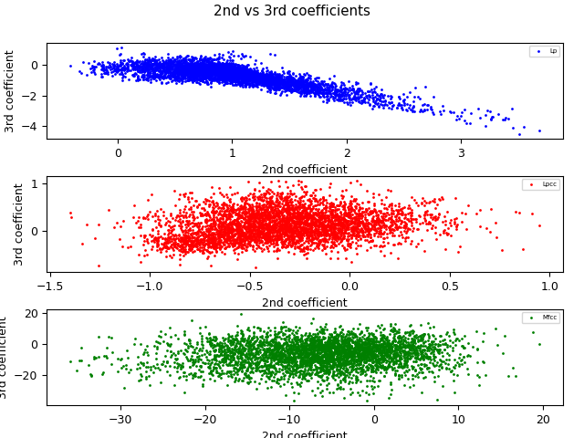

PAV - P4: reconocimiento y verificación del locutor
===================================================

Obtenga su copia del repositorio de la práctica accediendo a [Práctica 4](https://github.com/albino-pav/P4)
y pulsando sobre el botón `Fork` situado en la esquina superior derecha. A continuación, siga las
instrucciones de la [Práctica 2](https://github.com/albino-pav/P2) para crear una rama con el apellido de
los integrantes del grupo de prácticas, dar de alta al resto de integrantes como colaboradores del proyecto
y crear la copias locales del repositorio.

También debe descomprimir, en el directorio `PAV/P4`, el fichero [db_8mu.tgz](https://atenea.upc.edu/mod/resource/view.php?id=3508877?forcedownload=1)
con la base de datos oral que se utilizará en la parte experimental de la práctica.

Como entrega deberá realizar un *pull request* con el contenido de su copia del repositorio. Recuerde
que los ficheros entregados deberán estar en condiciones de ser ejecutados con sólo ejecutar:

~~~~~~~~~~~~~~~~~~~~~~~~~~~~~~~~~~~~~~~~~~~~~~~~~~~~~.sh
  make release
  run_spkid mfcc train test classerr verify verifyerr
~~~~~~~~~~~~~~~~~~~~~~~~~~~~~~~~~~~~~~~~~~~~~~~~~~~~~

Recuerde que, además de los trabajos indicados en esta parte básica, también deberá realizar un proyecto
de ampliación, del cual deberá subir una memoria explicativa a Atenea y los ficheros correspondientes al
repositorio de la práctica.

A modo de memoria de la parte básica, complete, en este mismo documento y usando el formato *markdown*, los
ejercicios indicados.

## Ejercicios.

### SPTK, Sox y los scripts de extracción de características.

- Analice el script `wav2lp.sh` y explique la misión de los distintos comandos involucrados en el *pipeline*
  principal (`sox`, `$X2X`, `$FRAME`, `$WINDOW` y `$LPC`). Explique el significado de cada una de las 
  opciones empleadas y de sus valores.
  
  El pipeline principal es:  
``` bash
sox $inputfile -t raw -e signed -b 16 - | $X2X +sf | $FRAME -l 240 -p 80 | $WINDOW -l 240 -L 240 |
$LPC -l 240 -m $lpc_order > $base.lp
```
Usamos sox para convertir una señal ``inputfile`` (en este caso, en formato .wav) a tipo raw (sin headers) con ``-t raw``. Además, se usa una codificación con signo ``-e signed`` y cada muestra está cuantificada con 16 bits ``-b 16``.

Seguido, usamos ``x2x`` para convertir los datos de short con signo a float ``+sf``. A continuación, entramamos la señal usando el comando ``frame`` con un tamaño de trama de 240 muestras/30 ms (``-l 240``) y un desplazamiento entre frames de 80 muestras (``-p 80``). Luego, se enventana la señal (``window``) indicando el tamaño de frame de la entrada (``-l 240``) y el de la salida, que es el mismo (``-L 240``).

Finalmente para obtener los coeficientes del LPC que se hace con el comando ``lpc``. Se ha de indicar el tamaño de frame de entrada (``-l 240``) y el orden del LPC ``-m``, el cual en este caso lo indica el usuario. Este resultado se guarda en un fichero temporal ``$base.lp``.

- Explique el procedimiento seguido para obtener un fichero de formato *fmatrix* a partir de los ficheros de
  salida de SPTK (líneas 45 a 47 del script `wav2lp.sh`).
  
~~~~~~~~~~~~~~~~~~~~~~~~~~~~~~~~~~~~~~~~~~~~~~~~~~~~~.sh
# Our array files need a header with the number of cols and rows:
ncol=$((lpc_order+1)) # lpc p =>  (gain a1 a2 ... ap) 
nrow=`$X2X +fa < $base.lp | wc -l | perl -ne 'print $_/'$ncol', "\n";'`
~~~~~~~~~~~~~~~~~~~~~~~~~~~~~~~~~~~~~~~~~~~~~~~~~~~~~

En primer lugar para conseguir el numero de columnas de manera directa vemo que corresponen a el numero de coeficientes LPC +1
Para el numero de filas, convertimos la señal parametrizada a texto con ``$X2X``, tendremos un valor en cada línea, lo cual se manda a ``wc``, que usando la opción ``-l`` obtiene el número de líneas que se le pasen. Ahora que tenemos el número de valores de nuestro fichero, debido a que tiene siempre ``ncol`` columnas en todas las filas, podemos obtener el número de filas con el comando ``perl -ne 'print $_/'$ncol', "\n";'``. Este divide el valor pasado por la pipeline por la variable ``ncol``.

  * ¿Por qué es conveniente usar este formato (u otro parecido)? Tenga en cuenta cuál es el formato de
    entrada y cuál es el de resultado.
    
    Con *fmatrix* podemos ver los contenidos en ASCII. El fichero que tenemos de entrada es un conjunto de floats concatenados, los cuales no podemos interpretar directamente, ya que no están en ASCII ni ordenados según tramas/coeficientes. con ``fmatrix_show`` podemos ver los datos por filas o columnas y con ``cut`` `podemos guardar el contenido en ficheros de texto.
    
- Escriba el *pipeline* principal usado para calcular los coeficientes cepstrales de predicción lineal
  (LPCC) en su fichero <code>scripts/wav2lpcc.sh</code>:
  
~~~~~~~~~~~~~~~~~~~~~~~~~~~~~~~~~~~~~~~~~~~~~~~~~~~~~.sh
sox $inputfile -t raw -e signed -b 16 - | $X2X +sf | $FRAME -l 240 -p 80 | $WINDOW -l 240 -L 240 |
	$LPC -l 240 -m $lpc_order |$LPCC -m $lpc_order -M $lpcc_order > $base.lp   
~~~~~~~~~~~~~~~~~~~~~~~~~~~~~~~~~~~~~~~~~~~~~~~~~~~~~

- Escriba el *pipeline* principal usado para calcular los coeficientes cepstrales en escala Mel (MFCC) en su
  fichero <code>scripts/wav2mfcc.sh</code>:

~~~~~~~~~~~~~~~~~~~~~~~~~~~~~~~~~~~~~~~~~~~~~~~~~~~~~.sh
sox $inputfile -t raw -e signed -b 16 - | $X2X +sf | $FRAME -l 240 -p 80 | $WINDOW -l 240 -L 240 |
	$MFCC -l 240 -s 8 -w 0 -m $mfcc_order -n $mel_filter_bank_order > $base.mfcc
~~~~~~~~~~~~~~~~~~~~~~~~~~~~~~~~~~~~~~~~~~~~~~~~~~~~~

### Extracción de características.

- Inserte una imagen mostrando la dependencia entre los coeficientes 2 y 3 de las tres parametrizaciones
  para todas las señales de un locutor.
  
     <p align="center">
   
   </p>
  
  + Indique **todas** las órdenes necesarias para obtener las gráficas a partir de las señales 
    parametrizadas.
  ~~~~~~~~~~~~~~~~~~~~~~~~~~~~~~~~~~~~~~~~~~~~~~~~~~~~~.sh
  fmatrix_show work/lp/BLOCK00/SES000/*.lp | egrep '^\[' | cut -f4,5 > lp_2_3.txt
  fmatrix_show work/lpcc/BLOCK00/SES000/*.lpcc | egrep '^\[' | cut -f4,5 > lpcc_2_3.txt
  fmatrix_show work/mfcc/BLOCK00/SES000/*.mfcc | egrep '^\[' | cut -f4,5 > mfcc_2_3.txt
  ~~~~~~~~~~~~~~~~~~~~~~~~~~~~~~~~~~~~~~~~~~~~~~~~~~~~~
  Hemos de tener en cuenta que la primera columna es un contador de tramas por lo que no nos sirve y lo mismo con la segunda columna que corresponde a la ganancia en caso del LP y LPCC, así que escogemos la quarta y la quinta para los coefs 2 y 3.
  
  + ¿Cuál de ellas le parece que contiene más información?

  En el caso LP la relación entre coeficientes se dispersa de una manera más o menos lineal. Por otro lado, para el LPCC y MFCC vemos que las relaciones entre coeficientes siguen distribuciones mas dispersas por lo que podemos decir que estan menos correlados que los LP. La información que nos proporciona un coeficiente respecto al otro es más grande en LPCC/MFCC, ya que dependen menos uno del otro.

- Usando el programa <code>pearson</code>, obtenga los coeficientes de correlación normalizada entre los
  parámetros 2 y 3 para un locutor, y rellene la tabla siguiente con los valores obtenidos.

  |                        | LP   | LPCC | MFCC |
  |------------------------|:----:|:----:|:----:|
  | &rho;<sub>x</sub>[2,3] |-0.823|0.1981|0.0995|
  
  + Compare los resultados de <code>pearson</code> con los obtenidos gráficamente.

  De forma similar a lo concluido previamente vemos que para el LP el valor de relación entre coeficientes es cercano a 1 que implica una alta correlación normalizada. En cambio para el LPCC y MFCC toman valores cercanos a 0, es decir una baja correlación normalizada. Visto que mayor dispersión nos aporta mejores resultados concluimos que menos correlación implica más información.
  
- Según la teoría, ¿qué parámetros considera adecuados para el cálculo de los coeficientes LPCC y MFCC?

En la teoría el orden de los coeficientes LPCC puede variar desde 13 hasta 18 
Para el orden de los coeficientes MFCC de forma similar al anterior suelen ser de unos 13 pero tambien usando unos 24-40 filtros 

### Entrenamiento y visualización de los GMM.

Complete el código necesario para entrenar modelos GMM.

- Inserte una gráfica que muestre la función de densidad de probabilidad modelada por el GMM de un locutor
  para sus dos primeros coeficientes de MFCC.
  
- Inserte una gráfica que permita comparar los modelos y poblaciones de dos locutores distintos (la gŕafica
  de la página 20 del enunciado puede servirle de referencia del resultado deseado). Analice la capacidad
  del modelado GMM para diferenciar las señales de uno y otro.

### Reconocimiento del locutor.

Complete el código necesario para realizar reconociminto del locutor y optimice sus parámetros.

- Inserte una tabla con la tasa de error obtenida en el reconocimiento de los locutores de la base de datos
  SPEECON usando su mejor sistema de reconocimiento para los parámetros LP, LPCC y MFCC.
  
  |                        | LP   | LPCC | MFCC |
  |------------------------|:----:|:----:|:----:|
  | Tasa de error 	   |10.83%|0.64% | 9.43%|

### Verificación del locutor.

Complete el código necesario para realizar verificación del locutor y optimice sus parámetros.

- Inserte una tabla con el *score* obtenido con su mejor sistema de verificación del locutor en la tarea
  de verificación de SPEECON. La tabla debe incluir el umbral óptimo, el número de falsas alarmas y de
  pérdidas, y el score obtenido usando la parametrización que mejor resultado le hubiera dado en la tarea
  de reconocimiento.
  
  |                        | Resultados con LPCC |
  |------------------------|:-------------------------:|
  | Umbral óptimo | 0.171370027055398 |
  | # falsas alarmas | 4/1000=0.0040 |
  | # pérdidas | 17/250=0.0680 |
  | **SCORE** | 10.4 |
 
### Test final

- Adjunte, en el repositorio de la práctica, los ficheros `class_test.log` y `verif_test.log` 
  correspondientes a la evaluación *ciega* final.
  + [class_test.log](class_test.log)
  + [verif_test.log](verif_test.log)

### Trabajo de ampliación.

- Recuerde enviar a Atenea un fichero en formato zip o tgz con la memoria (en formato PDF) con el trabajo 
  realizado como ampliación, así como los ficheros `class_ampl.log` y/o `verif_ampl.log`, obtenidos como 
  resultado del mismo.
